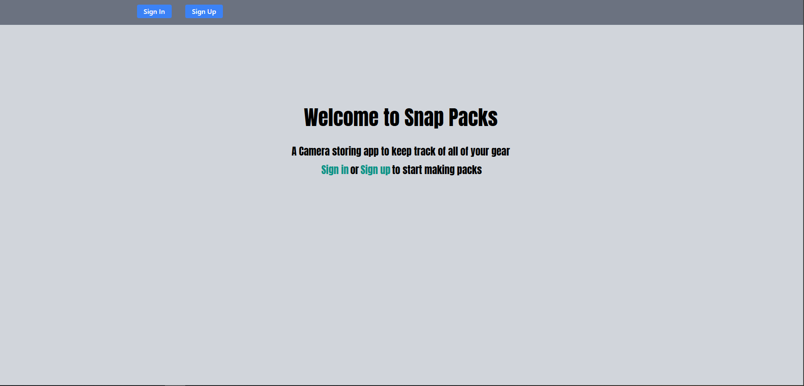
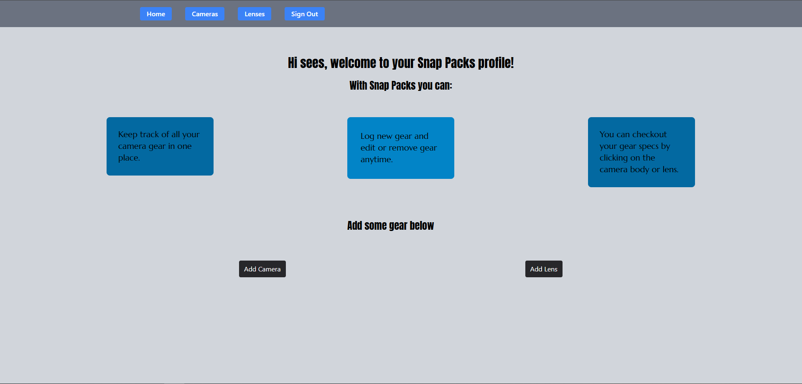

# Snap Packs

## An app for storing and editing your camera gear made with Express, EJS, and Mongoose

AAU you can login or create an account if you're new
Once logged in you can add either Camera bodies or lenses that you own and theyll be stored in a database using mongoDB.
You can add a new camera using the add camera button and same for the lenses.
Once added, you can click on the specific camera or lens to checkout that gears specs in their respective routes.
In the Show route, you have the option to edit the selected gear or remove it from your inventory

## Technologies

## Desktop Version

Try it out here [here](https://github.com/Cpreza24/snap-packs)

## Attributions

[ExpressJS Documentation](https://expressjs.com/) [Tailwindcss Documentation](https://tailwindcss.com/) [Stack overflow](https://stackoverflow.com/) [Contrast Accessibility Checker](https://webaim.org/resources/contrastchecker/)

## Future Enhancements

I plan on adding a "backpack" feature to allow the use to select what gear they have in their bag that day.
Also a feature to see other users gear and a "sell" option to put gear up for sale and allow other users to purchase it and add it to their inventory.

## Author

Cesar Preza [LinkdIn](https://www.linkedin.com/in/cesar-preza-72675278/) [GitHub](https://github.com/Cpreza24)
